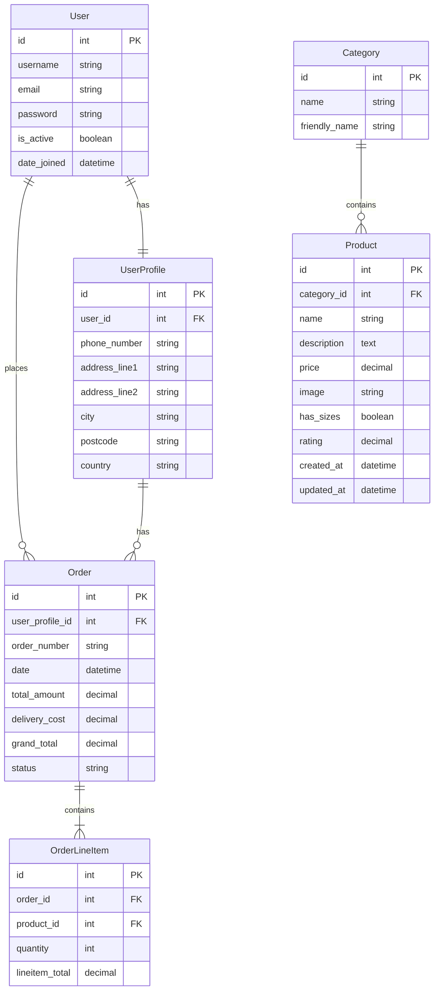

# Entity Relationship Diagram (ERD) for Titan-Clothing

## Entity Descriptions

### User

-   Represents the user account in the system
-   Contains basic authentication information
-   One-to-one relationship with UserProfile

### UserProfile

-   Extended user information
-   Contains delivery details
-   One-to-many relationship with Orders

### Order

-   Represents a purchase order
-   Contains order details and totals
-   One-to-many relationship with OrderLineItems

### OrderLineItem

-   Represents individual items in an order
-   Contains quantity and line item total
-   Many-to-one relationship with Product

### Category

-   Represents product categories
-   Contains category name and friendly name
-   One-to-many relationship with Products

### Product

-   Represents clothing items
-   Contains product details and pricing
-   Many-to-one relationship with Category

## Relationships

1. User → UserProfile: One-to-One
2. UserProfile → Order: One-to-Many
3. Order → OrderLineItem: One-to-Many
4. OrderLineItem → Product: Many-to-One
5. Category → Product: One-to-Many
